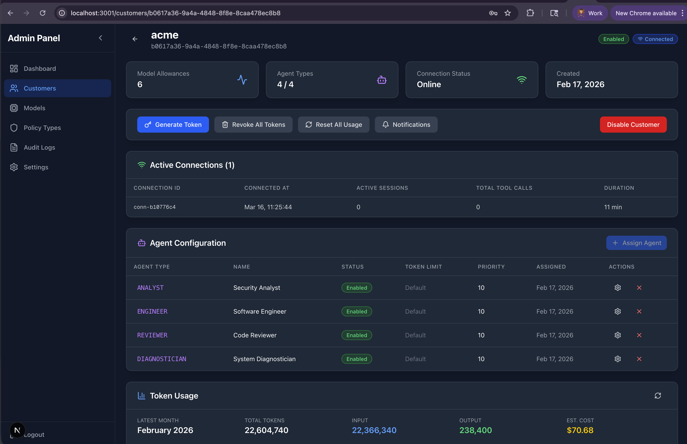

# Admin Console

The Admin Console is the centralized management interface for the Server-Agents platform. It provides administrators with full visibility and control over a **lights-out autonomous agent environment** — where AI agents operate independently across the software development lifecycle without requiring constant human intervention.

## Purpose

In a lights-out deployment, autonomous agents (Analyst, Engineer, Reviewer, Diagnostician) run continuously, consuming LLM tokens, executing tool calls, and producing results. The Admin Console exists to:

- **Monitor token usage and cost** across all customers, models, and agents
- **Manage autonomous agents** — assign agent types, configure priorities, enable/disable agents, and set token limits per agent
- **Track active connections and sessions** — see which agents are connected, how long they've been running, and what tool calls they're making
- **Control customer access** — create customers, generate and revoke API tokens, enable/disable accounts
- **Enforce usage policies** — set token allowances with configurable reset policies (daily, weekly, monthly) to prevent runaway costs
- **Audit all activity** — review a comprehensive security and operational audit trail

## Console Overview

The screenshot above shows the customer detail view, which includes:

- **Model Allowances** — the number of LLM models allocated to the customer
- **Agent Types** — the count of configured autonomous agents (Analyst, Engineer, Reviewer, Diagnostician)
- **Connection Status** — real-time connectivity indicator showing whether the agent client is online
- **Active Connections** — live WebSocket connections with session counts, tool call totals, and duration
- **Agent Configuration** — a table of all assigned agents with their type, name, status, token limit, priority, and management actions
- **Token Usage** — monthly totals for input/output tokens, total token consumption, and estimated cost

## Key Capabilities

| Capability | Description |
|------------|-------------|
| **Dashboard** | System-wide statistics, recent activity, and quick actions |
| **Customer Management** | Create, enable/disable customers, manage API tokens and allowances |
| **Agent Assignment** | Assign and configure autonomous agents per customer with token limits and priorities |
| **Model Management** | Add/configure LLM models, set default token allocations |
| **Policy Configuration** | Define token reset policies to control spend in unattended environments |
| **Audit Logs** | Filter and review security events, cleanup old entries |
| **Usage Monitoring** | Track token consumption, estimated costs, and usage trends per customer and model |

## Why This Matters for Lights-Out Operations

Without the Admin Console, autonomous agents would run without guardrails. The console provides the operational controls necessary to:

1. **Prevent cost overruns** — token allowances and reset policies cap spending per customer, per model
2. **Maintain visibility** — real-time connection status and usage metrics ensure operators know what agents are doing
3. **Respond to issues** — disable customers, revoke tokens, or shut down agents immediately when needed
4. **Ensure compliance** — the audit trail records every significant event for review

For full technical details on the admin UI, see the [Admin UI README](../admin-ui/README.md).
