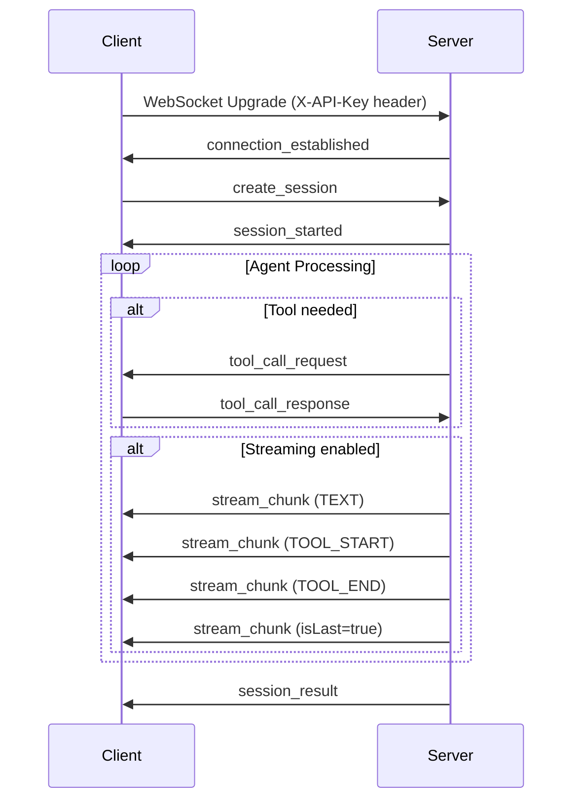
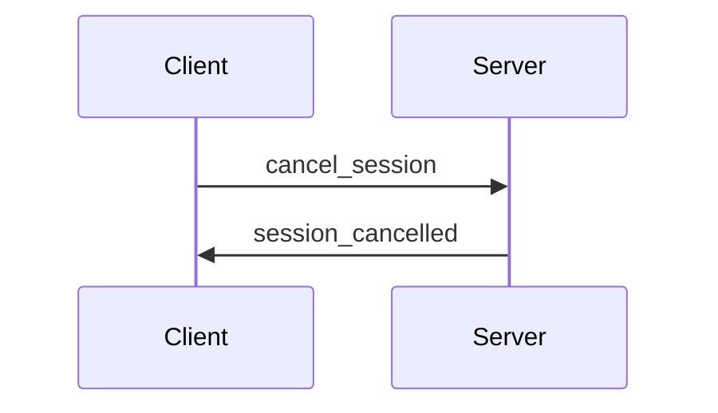
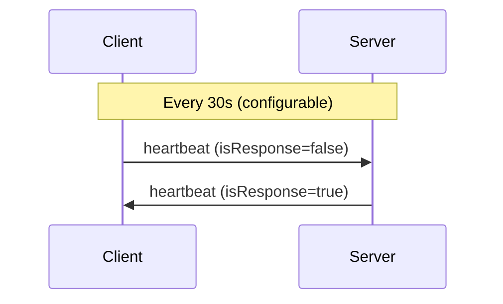
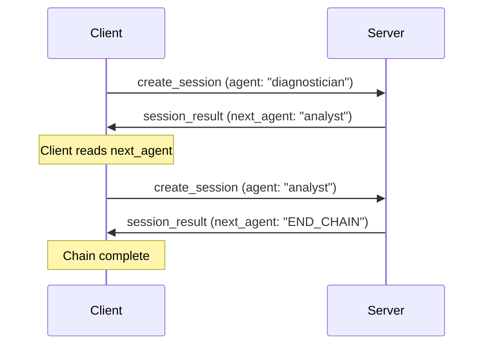
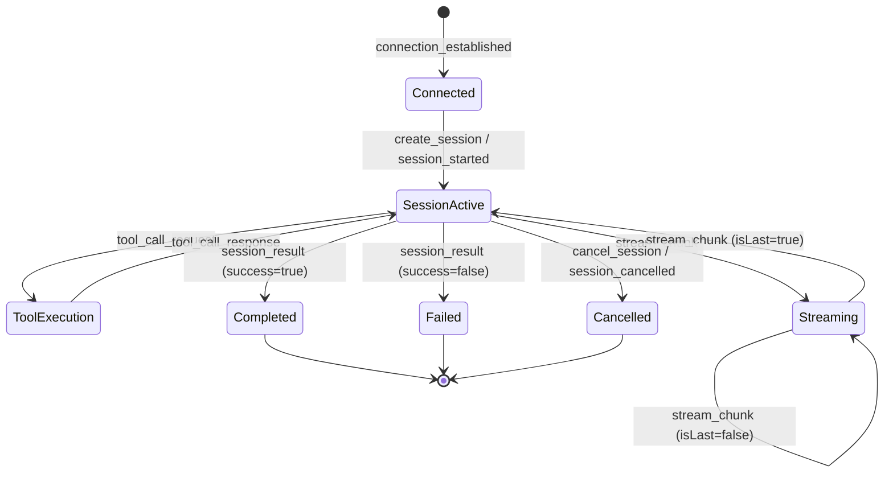

# Agent Message Protocol Specification

**Version:** 1.0.0
**Transport:** WebSocket (RFC 6455)
**Encoding:** JSON (UTF-8)
**Authentication:** `X-API-Key` header on WebSocket upgrade request

## Overview

The Agent Message Protocol defines the communication contract between an **Agent Client** (SDK) and an **Agent Server** (proxy) over a persistent WebSocket connection. All messages are JSON objects distinguished by a `type` discriminator field and share a common base envelope.

Messages are polymorphically deserialized via Jackson `@JsonTypeInfo` / `@JsonSubTypes` on the `McpProxyMessage` base class.

## Base Message Envelope

Every message inherits these fields from `McpProxyMessage`:

| Field | Type | Required | Description |
|-------|------|----------|-------------|
| `type` | `string` | Yes | Discriminator field identifying the message type |
| `messageId` | `string` (UUID) | Yes | Unique identifier for this message, auto-generated |
| `timestamp` | `string` (ISO-8601 Instant) | Yes | Time the message was created, auto-generated |

## Message Catalog

| Type Value | Direction | Java Class | Description |
|------------|-----------|------------|-------------|
| `connection_established` | Server -> Client | `ConnectionEstablished` | WebSocket connection confirmed with server capabilities |
| `session_started` | Server -> Client | `SessionStarted` | Session successfully created and running |
| `tool_call_request` | Server -> Client | `ToolCallRequest` | Server requests client to execute a tool |
| `stream_chunk` | Server -> Client | `StreamChunk` | Incremental streaming response chunk |
| `session_result` | Server -> Client | `SessionResult` | Final result of a completed session |
| `session_cancelled` | Server -> Client | `SessionCancelled` | Confirmation that a session was cancelled |
| `error` | Server -> Client | `ErrorMessage` | Error notification |
| `create_session` | Client -> Server | `CreateSession` | Request to create a new agent session |
| `tool_call_response` | Client -> Server | `ToolCallResponse` | Result of a tool execution |
| `cancel_session` | Client -> Server | `CancelSession` | Request to cancel an active session |
| `heartbeat` | Bidirectional | `Heartbeat` | Keep-alive ping/pong |

---

## Message Flows

### Session Lifecycle



### Session Cancellation



### Heartbeat Keep-Alive



### Agent Chaining



### Session State Machine



---

## Client -> Server Messages

### `create_session`

Sent by the client to create a new agent session. The client generates the `sessionId` which becomes the authoritative identifier for the session.

| Field | Type | Required | Description |
|-------|------|----------|-------------|
| `sessionId` | `string` | Yes | Client-generated unique session identifier |
| `agent` | [`Agent`](#agent) | Yes | Agent configuration (name, type, instructions, etc.) |
| `schema` | `string` | No | JSON Schema defining expected output format |
| `tools` | [`ToolDefinition[]`](#tooldefinition) | Yes | Tools available for the agent to call |
| `streamResponse` | `boolean` | Yes | Whether to stream intermediate results via `stream_chunk` |
| `maxDurationSeconds` | `integer` | Yes | Maximum allowed session duration |
| `promptParams` | `object` (JSON) | No | Parameters for prompt template substitution. Defaults to `{}` |

```json
{
  "type": "create_session",
  "messageId": "550e8400-e29b-41d4-a716-446655440000",
  "timestamp": "2026-03-16T10:30:00Z",
  "sessionId": "sess-abc-123",
  "agent": {
    "name": "code-reviewer",
    "description": "Reviews code for quality and correctness",
    "type": "REVIEWER",
    "instructions": "Review the provided code for bugs, style issues, and security vulnerabilities.",
    "tools": ["github.get_file_contents", "github.list_pull_requests"],
    "output_schema": "{\"type\":\"object\",\"properties\":{\"success\":{\"type\":\"boolean\"},\"reason\":{\"type\":\"string\"}}}",
    "next_agent": "analyst"
  },
  "tools": [
    {
      "name": "github.get_file_contents",
      "description": "Read file contents from a GitHub repository",
      "inputSchema": {
        "type": "object",
        "properties": {
          "path": { "type": "string" },
          "repo": { "type": "string" }
        },
        "required": ["path", "repo"]
      }
    }
  ],
  "streamResponse": true,
  "maxDurationSeconds": 300,
  "promptParams": {
    "repository": "server-agents",
    "branch": "trunk"
  }
}
```

### `tool_call_response`

Sent by the client after executing a tool requested by the server.

| Field | Type | Required | Description |
|-------|------|----------|-------------|
| `sessionId` | `string` | Yes | Session this response belongs to |
| `requestId` | `string` | Yes | Matches the `requestId` from the corresponding `tool_call_request` |
| `success` | `boolean` | Yes | Whether the tool executed successfully |
| `result` | `string` | No | JSON-stringified tool result |
| `errorMessage` | `string` | No | Error description if `success` is `false` |
| `executionTimeMs` | `long` | Yes | Wall-clock execution time in milliseconds |

```json
{
  "type": "tool_call_response",
  "messageId": "660e8400-e29b-41d4-a716-446655440001",
  "timestamp": "2026-03-16T10:30:05Z",
  "sessionId": "sess-abc-123",
  "requestId": "req-001",
  "success": true,
  "result": "{\"content\": \"public class Main { ... }\"}",
  "errorMessage": null,
  "executionTimeMs": 245
}
```

### `cancel_session`

Sent by the client to cancel an active session.

| Field | Type | Required | Description |
|-------|------|----------|-------------|
| `sessionId` | `string` | Yes | Session to cancel |
| `reason` | `string` | Yes | Human-readable cancellation reason |

```json
{
  "type": "cancel_session",
  "messageId": "770e8400-e29b-41d4-a716-446655440002",
  "timestamp": "2026-03-16T10:31:00Z",
  "sessionId": "sess-abc-123",
  "reason": "User requested cancellation"
}
```

---

## Server -> Client Messages

### `connection_established`

Sent by the server immediately after the WebSocket connection is accepted.

| Field | Type | Required | Description |
|-------|------|----------|-------------|
| `connectionId` | `string` | Yes | Unique identifier for this connection |
| `serverVersion` | `string` | Yes | Server version string |
| `maxConcurrentSessions` | `integer` | Yes | Maximum number of concurrent sessions allowed |
| `capabilities` | [`Capabilities`](#capabilities) | Yes | Server capability advertisement |

```json
{
  "type": "connection_established",
  "messageId": "880e8400-e29b-41d4-a716-446655440003",
  "timestamp": "2026-03-16T10:29:59Z",
  "connectionId": "conn-xyz-789",
  "serverVersion": "1.0.0",
  "maxConcurrentSessions": 10,
  "capabilities": {
    "streamingSupported": true,
    "maxConcurrentSessions": 10,
    "sessionTimeoutSeconds": 600,
    "toolCallTimeoutSeconds": 30
  }
}
```

### `session_started`

Sent by the server to confirm that a session has been created and is running.

| Field | Type | Required | Description |
|-------|------|----------|-------------|
| `sessionId` | `string` | Yes | The client-generated session identifier |
| `toolCount` | `integer` | Yes | Number of tools registered for the session |

```json
{
  "type": "session_started",
  "messageId": "990e8400-e29b-41d4-a716-446655440004",
  "timestamp": "2026-03-16T10:30:01Z",
  "sessionId": "sess-abc-123",
  "toolCount": 3
}
```

### `tool_call_request`

Sent by the server when the agent needs to execute a tool on the client side.

| Field | Type | Required | Description |
|-------|------|----------|-------------|
| `sessionId` | `string` | Yes | Session this request belongs to |
| `requestId` | `string` | Yes | Unique request identifier; client must echo this in `tool_call_response` |
| `toolName` | `string` | Yes | Name of the tool to execute |
| `deadline` | `string` (ISO-8601 Instant) | No | Deadline by which the tool call must complete |
| `arguments` | `object` | No | Tool input arguments. Accepts JSON object or JSON-encoded string |

```json
{
  "type": "tool_call_request",
  "messageId": "aa0e8400-e29b-41d4-a716-446655440005",
  "timestamp": "2026-03-16T10:30:02Z",
  "sessionId": "sess-abc-123",
  "requestId": "req-001",
  "toolName": "github.get_file_contents",
  "deadline": "2026-03-16T10:30:32Z",
  "arguments": {
    "path": "src/main/java/Main.java",
    "repo": "server-agents"
  }
}
```

### `stream_chunk`

Sent by the server to deliver incremental streaming content. Only sent when `streamResponse` is `true` in the `create_session` request.

| Field | Type | Required | Description |
|-------|------|----------|-------------|
| `sessionId` | `string` | Yes | Session this chunk belongs to |
| `sequenceNumber` | `integer` | Yes | Monotonically increasing sequence number within the session |
| `chunkType` | [`ChunkType`](#chunktype) | Yes | Type of content in this chunk |
| `content` | `string` | No | Text content of the chunk |
| `toolCall` | [`ToolCallInfo`](#toolcallinfo) | No | Tool call metadata (present when `chunkType` is `TOOL_START` or `TOOL_END`) |
| `isLast` | `boolean` | Yes | `true` if this is the final chunk in the stream |

```json
{
  "type": "stream_chunk",
  "messageId": "bb0e8400-e29b-41d4-a716-446655440006",
  "timestamp": "2026-03-16T10:30:03Z",
  "sessionId": "sess-abc-123",
  "sequenceNumber": 1,
  "chunkType": "TEXT",
  "content": "Analyzing the code structure...",
  "toolCall": null,
  "isLast": false
}
```

**Tool Start Example:**

```json
{
  "type": "stream_chunk",
  "sessionId": "sess-abc-123",
  "sequenceNumber": 2,
  "chunkType": "TOOL_START",
  "content": null,
  "toolCall": {
    "toolName": "github.get_file_contents",
    "requestId": "req-001",
    "arguments": { "path": "Main.java" },
    "result": null,
    "success": false
  },
  "isLast": false
}
```

### `session_result`

Sent by the server when a session completes (successfully or with failure).

| Field | Type | Required | Description |
|-------|------|----------|-------------|
| `sessionId` | `string` | Yes | The session identifier |
| `success` | `boolean` | Yes | Whether the session completed successfully |
| `content` | `object` (JSON) | No | The agent's response content. Also accepts `"response"` as an alias for backward compatibility |
| `errorMessage` | `string` | No | Error description if `success` is `false` |
| `toolCallsExecuted` | `integer` | Yes | Total number of tool calls executed |
| `totalDurationMs` | `long` | Yes | Total session duration in milliseconds |
| `metrics` | [`SessionMetrics`](#sessionmetrics) | No | Detailed session metrics |
| `next_agent` | `string` | No | Name of the next agent in the chain, or a [`NextAgentStatus`](#nextagentstatus) value |

```json
{
  "type": "session_result",
  "messageId": "cc0e8400-e29b-41d4-a716-446655440007",
  "timestamp": "2026-03-16T10:30:10Z",
  "sessionId": "sess-abc-123",
  "success": true,
  "content": {
    "success": true,
    "reason": "Code review completed. Found 2 style issues and 1 potential null pointer."
  },
  "errorMessage": null,
  "toolCallsExecuted": 3,
  "totalDurationMs": 9500,
  "metrics": {
    "durationMs": 9500,
    "toolCallCount": 3,
    "tokenCount": 2048
  },
  "next_agent": "analyst"
}
```

**Chain Termination Example:**

```json
{
  "type": "session_result",
  "sessionId": "sess-abc-456",
  "success": true,
  "content": { "success": true, "reason": "Analysis complete." },
  "next_agent": "END_CHAIN"
}
```

### `session_cancelled`

Sent by the server to confirm a session cancellation.

| Field | Type | Required | Description |
|-------|------|----------|-------------|
| `sessionId` | `string` | Yes | The cancelled session identifier |
| `reason` | `string` | Yes | Reason for cancellation |
| `toolCallsCompleted` | `integer` | Yes | Number of tool calls that completed before cancellation |
| `toolCallsPending` | `integer` | Yes | Number of tool calls that were pending at cancellation time |

```json
{
  "type": "session_cancelled",
  "messageId": "dd0e8400-e29b-41d4-a716-446655440008",
  "timestamp": "2026-03-16T10:31:01Z",
  "sessionId": "sess-abc-123",
  "reason": "User requested cancellation",
  "toolCallsCompleted": 2,
  "toolCallsPending": 1
}
```

### `error`

Sent by the server for error conditions. May or may not be associated with a specific session.

| Field | Type | Required | Description |
|-------|------|----------|-------------|
| `sessionId` | `string` | No | Session the error relates to, if applicable |
| `code` | [`ErrorCode`](#errorcode) | Yes | Machine-readable error code |
| `message` | `string` | Yes | Human-readable error description |
| `details` | `object` | No | Additional error context as key-value pairs |

```json
{
  "type": "error",
  "messageId": "ee0e8400-e29b-41d4-a716-446655440009",
  "timestamp": "2026-03-16T10:30:06Z",
  "sessionId": "sess-abc-123",
  "code": "TOOL_CALL_TIMEOUT",
  "message": "Tool call exceeded deadline",
  "details": {
    "toolName": "github.get_file_contents",
    "requestId": "req-001",
    "timeoutMs": 30000
  }
}
```

---

## Bidirectional Messages

### `heartbeat`

Keep-alive message. Either side may initiate; the receiver responds with `isResponse: true`.

| Field | Type | Required | Description |
|-------|------|----------|-------------|
| `sequenceNumber` | `long` | Yes | Monotonically increasing heartbeat sequence |
| `isResponse` | `boolean` | Yes | `false` for ping, `true` for pong |

```json
{
  "type": "heartbeat",
  "messageId": "ff0e8400-e29b-41d4-a716-446655440010",
  "timestamp": "2026-03-16T10:30:30Z",
  "sequenceNumber": 42,
  "isResponse": false
}
```

---

## Shared Data Types

### Agent

Agent configuration record, typically loaded from `agent.yml`.

| Field | Type | Required | Description |
|-------|------|----------|-------------|
| `name` | `string` | Yes | Agent identifier (set from map key during loading) |
| `description` | `string` | Yes | Human-readable description of the agent's purpose |
| `type` | [`AgentType`](#agenttype) | Yes | Agent classification |
| `instructions` | `string` | Yes | Prompt instructions for the agent |
| `mcpServers` | `string` | No | MCP server configuration as a JSON string |
| `mcpConfig` | [`McpConfig`](#mcpconfig) | No | Parsed MCP configuration (set during loading) |
| `tools` | `string[]` | No | Tool identifiers in `"server-name.tool-name"` format |
| `output_schema` | `string` | No | JSON Schema string defining expected response format |
| `next_agent` | `string` | No | Name of the next agent for chaining |

### ToolDefinition

Describes a tool available for the agent to invoke.

| Field | Type | Required | Description |
|-------|------|----------|-------------|
| `name` | `string` | Yes | Unique tool name |
| `description` | `string` | Yes | Human-readable description |
| `inputSchema` | `object` | Yes | JSON Schema defining the tool's input parameters |

### ToolCallInfo

Metadata about a tool call, embedded within `StreamChunk` messages.

| Field | Type | Required | Description |
|-------|------|----------|-------------|
| `toolName` | `string` | Yes | Name of the tool |
| `requestId` | `string` | Yes | Unique request identifier |
| `arguments` | `object` | No | Tool input arguments |
| `result` | `string` | No | Tool result (populated in `TOOL_END` chunks) |
| `success` | `boolean` | Yes | Whether the tool call succeeded |

### Capabilities

Server capability advertisement sent during connection establishment.

| Field | Type | Required | Description |
|-------|------|----------|-------------|
| `streamingSupported` | `boolean` | Yes | Whether the server supports streaming responses |
| `maxConcurrentSessions` | `integer` | Yes | Maximum concurrent sessions per connection |
| `sessionTimeoutSeconds` | `integer` | Yes | Default session timeout |
| `toolCallTimeoutSeconds` | `integer` | Yes | Default tool call timeout |

### SessionMetrics

Performance metrics for a completed session.

| Field | Type | Required | Description |
|-------|------|----------|-------------|
| `durationMs` | `long` | Yes | Total duration in milliseconds |
| `toolCallCount` | `integer` | Yes | Number of tool calls made |
| `tokenCount` | `integer` | Yes | Total tokens consumed |

### BaseLlmResponse

Minimal response contract required from an LLM for structured output.

| Field | Type | Required | Description |
|-------|------|----------|-------------|
| `success` | `boolean` | Yes | Whether the LLM determined the operation was successful |
| `reason` | `string` | Yes | Concise, human-readable explanation justifying the result |

---

## Enumerations

### ErrorCode

| Value | Category | Description |
|-------|----------|-------------|
| `AUTHENTICATION_FAILED` | Auth | Authentication credentials are invalid |
| `UNAUTHORIZED` | Auth | Authenticated but not authorized for the requested action |
| `RATE_LIMITED` | Auth | Request rate limit exceeded |
| `CONNECTION_LIMIT_EXCEEDED` | Auth | Maximum connection limit reached |
| `SESSION_NOT_FOUND` | Session | Referenced session does not exist |
| `SESSION_EXPIRED` | Session | Session has expired |
| `SESSION_TIMEOUT` | Session | Session exceeded its maximum duration |
| `SESSION_LIMIT_EXCEEDED` | Session | Maximum concurrent session limit reached |
| `TOOL_NOT_FOUND` | Tool | Requested tool is not registered |
| `TOOL_EXECUTION_FAILED` | Tool | Tool execution threw an error |
| `TOOL_CALL_TIMEOUT` | Tool | Tool call exceeded its deadline |
| `TOOL_CALL_FAILED` | Tool | Tool call failed for an unspecified reason |
| `CONNECTION_ERROR` | Communication | WebSocket connection error |
| `INVALID_MESSAGE` | Communication | Message could not be parsed or is malformed |
| `INTERNAL_ERROR` | System | Unexpected server-side error |

### ChunkType

| Value | Description |
|-------|-------------|
| `TEXT` | Incremental text output from the agent |
| `TOOL_START` | Indicates a tool call has begun; `toolCall` field is populated |
| `TOOL_END` | Indicates a tool call has completed; `toolCall` field contains the result |
| `THINKING` | Agent reasoning/thinking content (may not be included in final output) |
| `ERROR` | An error occurred during streaming |

### AgentType

| Value | Description |
|-------|-------------|
| `ANALYST` | Data analysis and investigation agent |
| `ENGINEER` | Code generation and engineering agent |
| `REVIEWER` | Code review and quality assurance agent |
| `DIAGNOSTICIAN` | System diagnostics and troubleshooting agent |

### NextAgentStatus

Special values for the `next_agent` field in `SessionResult`:

| Value | Description |
|-------|-------------|
| `END_CHAIN` | Agent chain completed successfully; no further agents to invoke |
| `FAILED_AGENT` | Agent processing failed; chain should not continue |

---

## MCP Server Configuration

Agents can reference MCP (Model Context Protocol) servers for tool discovery. Three transport types are supported via a sealed interface hierarchy.

### McpConfig

| Field | Type | Description |
|-------|------|-------------|
| `mcpServers` | `Map<string, McpServer>` | Named map of server configurations |

### McpServer (sealed interface)

Implementations are selected based on the `type` field or auto-detected from the presence of `command` (stdio) or `url` (http/sse).

#### StdioServer

| Field | Type | Required | Description |
|-------|------|----------|-------------|
| `type` | `"stdio"` | Yes | Transport type |
| `name` | `string` | Yes | Server name |
| `command` | `string` | Yes | Command to execute |
| `args` | `string[]` | No | Command arguments |
| `env` | `object` | No | Environment variables |

#### HttpServer

| Field | Type | Required | Description |
|-------|------|----------|-------------|
| `type` | `"http"` or `"streamable-http"` | Yes | Transport type |
| `name` | `string` | Yes | Server name |
| `url` | `string` | Yes | Server URL |
| `headers` | `object` | No | HTTP headers |
| `env` | `object` | No | Environment variables |

#### SseServer

| Field | Type | Required | Description |
|-------|------|----------|-------------|
| `type` | `"sse"` | Yes | Transport type |
| `name` | `string` | Yes | Server name |
| `url` | `string` | Yes | SSE endpoint URL |
| `headers` | `object` | No | HTTP headers |
| `env` | `object` | No | Environment variables |

---

## Design Notes

- **Immutability**: All message classes are immutable and thread-safe. Collections are defensively copied.
- **Builder Pattern**: All messages support a fluent builder API for programmatic construction.
- **Polymorphic Deserialization**: Jackson `@JsonTypeInfo(property = "type")` with `@JsonSubTypes` enables automatic type resolution.
- **Flexible Arguments**: The `arguments` field in `ToolCallRequest` accepts both JSON objects and JSON-encoded strings via `StringOrMapDeserializer`.
- **Backward Compatibility**: `SessionResult.content` accepts both `"content"` and `"response"` as the JSON property name via `@JsonAlias`.
- **Unknown Properties Ignored**: All message classes use `@JsonIgnoreProperties(ignoreUnknown = true)` for forward compatibility.
