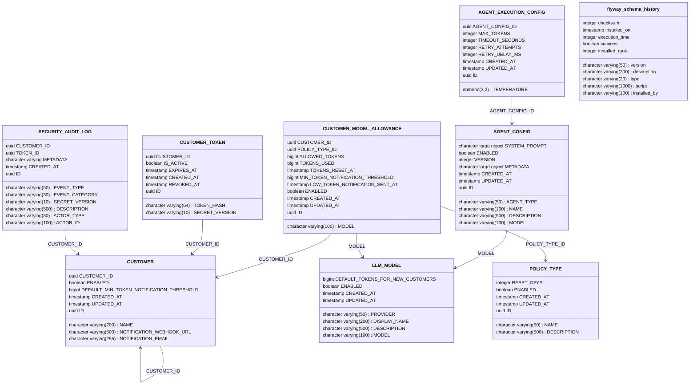

```mermaid
classDiagram
direction TB

    class AGENT_CONFIG {
        character varying(50) AGENT_TYPE
        character varying(100) NAME
        character varying(500) DESCRIPTION
        character large object SYSTEM_PROMPT
        character varying(100) MODEL
        boolean ENABLED
        integer VERSION
        character large object METADATA
        timestamp CREATED_AT
        timestamp UPDATED_AT
        uuid ID
    }
    class AGENT_EXECUTION_CONFIG {
        uuid AGENT_CONFIG_ID
        integer MAX_TOKENS
        numeric(3,2) TEMPERATURE
        integer TIMEOUT_SECONDS
        integer RETRY_ATTEMPTS
        integer RETRY_DELAY_MS
        timestamp CREATED_AT
        timestamp UPDATED_AT
        uuid ID
    }
    class CUSTOMER {
        uuid CUSTOMER_ID
        character varying(200) NAME
        boolean ENABLED
        bigint DEFAULT_MIN_TOKEN_NOTIFICATION_THRESHOLD
        character varying(500) NOTIFICATION_WEBHOOK_URL
        character varying(255) NOTIFICATION_EMAIL
        timestamp CREATED_AT
        timestamp UPDATED_AT
        uuid ID
    }
    class CUSTOMER_MODEL_ALLOWANCE {
        uuid CUSTOMER_ID
        character varying(100) MODEL
        uuid POLICY_TYPE_ID
        bigint ALLOWED_TOKENS
        bigint TOKENS_USED
        timestamp TOKENS_RESET_AT
        bigint MIN_TOKEN_NOTIFICATION_THRESHOLD
        timestamp LOW_TOKEN_NOTIFICATION_SENT_AT
        boolean ENABLED
        timestamp CREATED_AT
        timestamp UPDATED_AT
        uuid ID
    }
    class CUSTOMER_TOKEN {
        uuid CUSTOMER_ID
        character varying(64) TOKEN_HASH
        character varying(10) SECRET_VERSION
        boolean IS_ACTIVE
        timestamp EXPIRES_AT
        timestamp CREATED_AT
        timestamp REVOKED_AT
        uuid ID
    }
    class LLM_MODEL {
        character varying(50) PROVIDER
        character varying(200) DISPLAY_NAME
        character varying(500) DESCRIPTION
        bigint DEFAULT_TOKENS_FOR_NEW_CUSTOMERS
        boolean ENABLED
        timestamp CREATED_AT
        timestamp UPDATED_AT
        character varying(100) MODEL
    }
    class POLICY_TYPE {
        character varying(50) NAME
        character varying(500) DESCRIPTION
        integer RESET_DAYS
        boolean ENABLED
        timestamp CREATED_AT
        timestamp UPDATED_AT
        uuid ID
    }
    class SECURITY_AUDIT_LOG {
        character varying(50) EVENT_TYPE
        character varying(30) EVENT_CATEGORY
        uuid CUSTOMER_ID
        uuid TOKEN_ID
        character varying(10) SECRET_VERSION
        character varying(500) DESCRIPTION
        character varying METADATA
        character varying(30) ACTOR_TYPE
        character varying(100) ACTOR_ID
        timestamp CREATED_AT
        uuid ID
    }
    class flyway_schema_history {
        character varying(50) version
        character varying(200) description
        character varying(20) type
        character varying(1000) script
        integer checksum
        character varying(100) installed_by
        timestamp installed_on
        integer execution_time
        boolean success
        integer installed_rank
    }

AGENT_CONFIG --> LLM_MODEL : MODEL
AGENT_EXECUTION_CONFIG --> AGENT_CONFIG : AGENT_CONFIG_ID
CUSTOMER_MODEL_ALLOWANCE --> CUSTOMER : CUSTOMER_ID
CUSTOMER_MODEL_ALLOWANCE --> LLM_MODEL : MODEL
CUSTOMER_MODEL_ALLOWANCE --> POLICY_TYPE : POLICY_TYPE_ID
CUSTOMER_TOKEN --> CUSTOMER : CUSTOMER_ID
SECURITY_AUDIT_LOG --> CUSTOMER : CUSTOMER_ID
CUSTOMER --> CUSTOMER : CUSTOMER_ID
```
